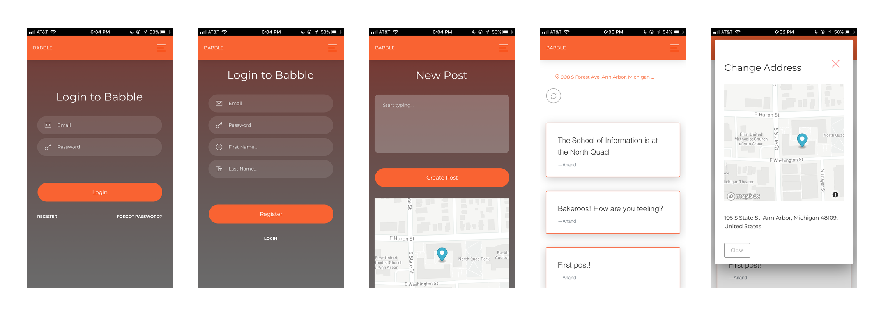

# Babble
A platform for location aware posts

### Screenshots



### Dependencies
- Python 3
- VirtualEnv
- PostgreSQL Database
- PostGIS

### Installation
```
virtualenv --python=python3 env
source env/bin/activate
pip install -r requirements.txt
```

Set the following environment variables for postgres database connection:
- RDS_USERNAME
- RDS_PASSWORD
- RDS_DB_NAME

### Running it
```
source env/bin/activate
python strange_encounters/main.py
```

### References

1. https://www.creative-tim.com/product/now-ui-kit

---

### Not Implemented
- Interaction
    - Ability to change address in Post
- Database
    - Schema migrations
- Security
    - CSRF protection

---
### Deployment

- We used Digital Ocean for deployment
- Our VM config: 512 MB / 20 GB Disk / Ubuntu 16.04.3 x64
- SSH keys were added for access to the server
- Created a Sudo user on server: https://www.digitalocean.com/community/tutorials/how-to-create-a-sudo-user-on-ubuntu-quickstart
- Added ssh keys to babble user
- Installation as `babble` user:
    ```
    cd ~
    wget https://bootstrap.pypa.io/get-pip.py
    sudo python3 get-pip.py
    sudo apt-get install nginx
    sudo apt-get install build-essential python3-dev
    sudo pip3 install virtualenv

    sudo apt-get install postgresql postgresql-contrib
    sudo sh -c 'echo "deb http://apt.postgresql.org/pub/repos/apt xenial-pgdg main" >> /etc/apt/sources.list'
    wget --quiet -O - http://apt.postgresql.org/pub/repos/apt/ACCC4CF8.asc | sudo apt-key add -
    sudo apt-get update

    sudo apt-get install postgresql-9.5-postgis-2.3 postgresql-9.5-postgis-scripts postgis postgresql-9.5-pgrouting
    sudo -u postgres createuser --superuser $USER; sudo -u postgres createdb $USER

    # sudo -u postgres
    # psql
    # \c babble
    # CREATE EXTENSION postgis;
    # \q
    # exit

    git clone https://github.com/anandpdoshi/strange-encounters.git
    cd strange-encounters
    virtualenv --python=python3 venv
    source venv/bin/activate
    pip install -r requirements.txt

    sudo mkdir -p /var/log/uwsgi
    sudo chown -R babble:babble /var/log/uwsgi

    sudo apt-get update
    sudo apt-get install software-properties-common
    sudo add-apt-repository ppa:certbot/certbot
    sudo apt-get update
    sudo apt-get install python-certbot-nginx

    cd ~/strange-encounters
    source venv/bin/activate
    python server/main.py initdb
    ```

- *This didn't work* — uWSGI setup based on: http://flask.pocoo.org/docs/0.12/deploying/uwsgi/
```
screen -S babble
cd ~/strange-encounters
source venv/bin/activate
uwsgi -s /tmp/babble.sock --manage-script-name --chdir server --mount /=main.py --callable app --processes 4 --threads 2 --http :8000 --chmod-socket=666
```

- Used flask app.run
```
screen -S babble
cd ~/strange-encounters
source venv/bin/activate
python server/main.py run
```
